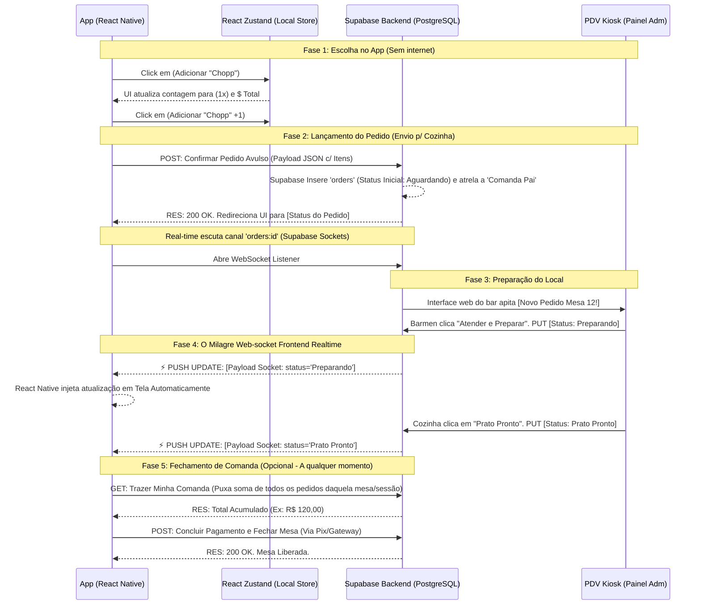

# Diagrama de Fluxo de Dados (DFD)

Abaixo descreve-se por meio de formato de sequência lógica o tráfego do dado em operações mais pesadas.

## Diagrama de Ciclo de Pedido & Sincronização em Tempo Real (Mermaid)

## Níveis Explicativos de Dados em Flow
1. **Zustand Interação:** Enquanto as edições do número de produtos ocorrem no carrinho (Ex: Mais cervejas ou exclusão de um prato), não deve estressar a leitura num banco de dados cloud remoto, a memória do celuar (Javascript state) segura e efetua todo trabalho de matemática.
2. **Postgres Inserção:** A transferência dos bits com formato JSON somente viaja em um disparo na rede HTTP sob ação incisiva (Apertar "Confirmar Pedido").
3. **Websocket Flow:** O status do pedido só viaja por uma via super leve através do Realtime API, poupando a API Supabase (REST), o que permite o React Native não se sobrecarregar, alterando componentes imediatamente.
